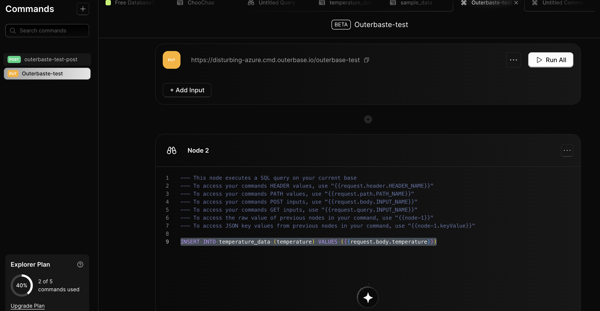

# Testing

For the first step, I needed to make sure that I was able to create some way to insert data into my database. I went with using Outerbase commands and it was pretty much just a few clicks to get it started. I've provided you with the SQL statements that I've used in the `sql` folder and also included the `INSERT` SQL statement that follows the outerbase syntax for commands.

Here's a behind the scenes look of what the command looks like!

I then wrote a simple Python script `testing.py` and ran that. `testing.py` calls the command that I created earlier and inserts that data into a free SQLite table every second.

# After

Now that I know everything is created, I can move into my master plan! Finding a way to gather data from my meat thermometer and update my Python testing script to get that data and insert it into my time series data. I also need to take a look at finding a way for my friends to be able to view and see the data that I'm generating.
